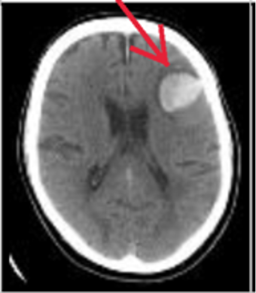
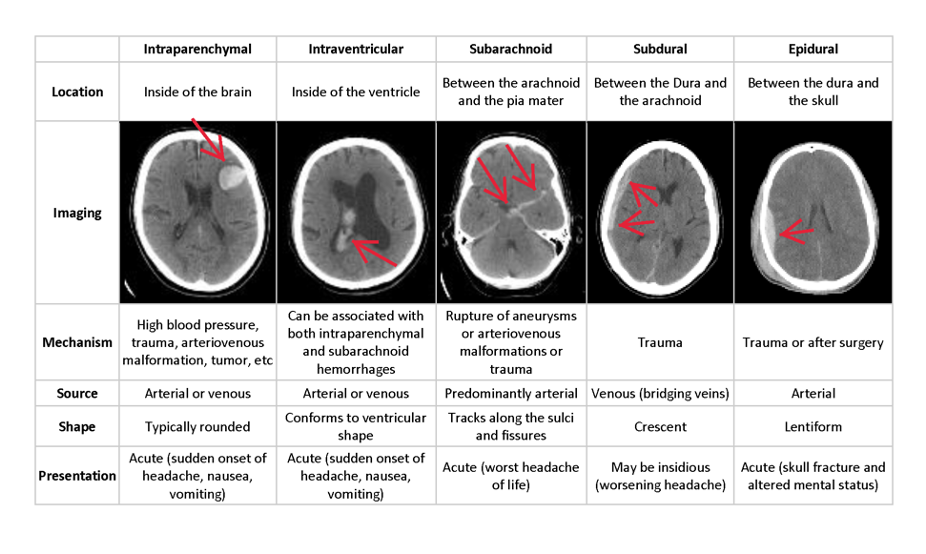
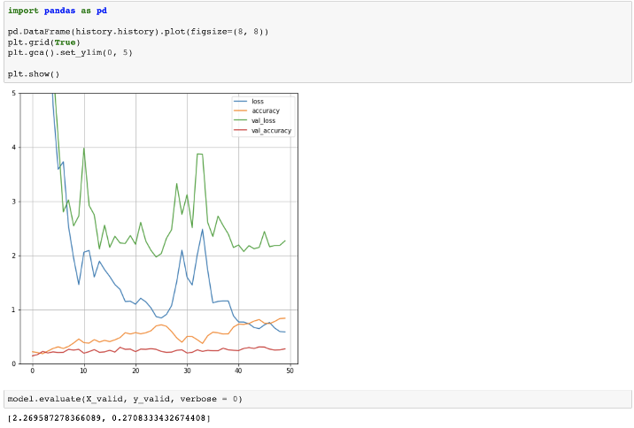
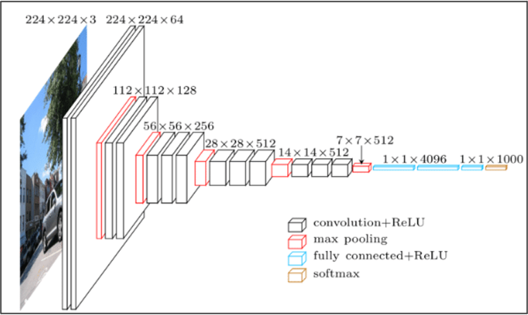
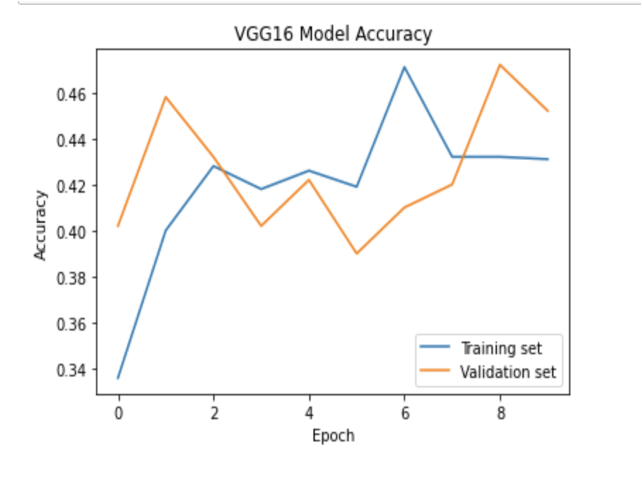
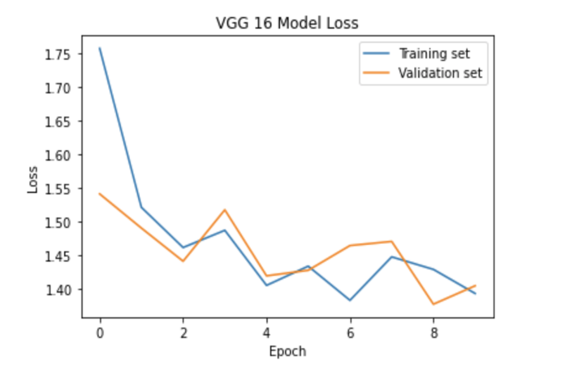
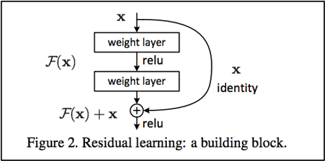
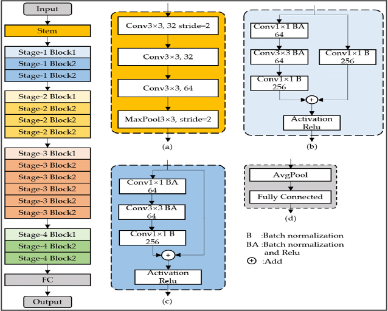
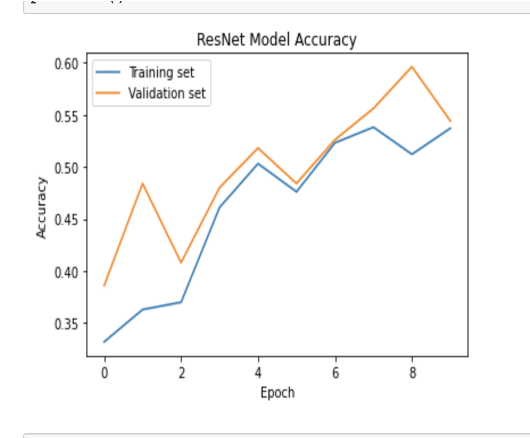
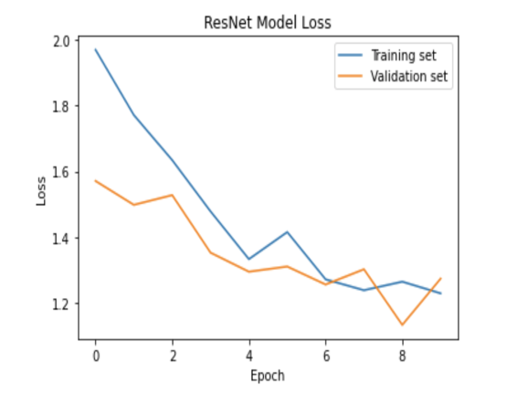

      <h4>Experimental Network Project</h4>
      

        

          <h5>Goal</h5>
          
Using a dataset of brain CT images provided by a company called Zeta Surgical, we will develop models to accurately classify and segment brain hemorrhages in these CT images.

          <h5>Zeta Surgical</h5>
          
A company focused on democratizing the access to accurate, safe and fast image guidance, to unlock the use of image guidance directly at the point-of-care, and to enable new treatments in cases such as emergenciies and bedside precedure.
 
        

        

          
        

      

       
      <h5>The CT Image Data Set</h5>
      
512x512 CT image scans labeled with locatiions of the hemorrhage in the brain and pixel coordinates of the outline of the hemorrhage.

       
        <h5>Attempt 1: Standard Neural Network</h5>
        <ul style="text-align: left;">
          <li>Small-scale first attempt</li>
          <li>200 of each type of hemorrhaging</li>
          <li>Using sequential keras model</li>
        </ul>
         
        <h5>Attempt 2: Visual Transformer</h5>
        
This did not work...

        <h5>Attempt 3: Transfer Learning - VGG16</h5>
        
VGG16 is a convolutional neural network model proposed by K. Simonyan and A. Zisserman from the University of Oxford in the paper "Very Deep Concolutional Networks for Large-Scale Image Recognition".

        
        
  
          
          
        

        <h5>Attempt 4: Transfer Learning - ResNet</h5>
        
A convolutional neural network model with a residual block

        

           
          
        

        
  
          
          
        

        <h5>Main Takeaways</h5>
        <ul style="text-align: left;">
          <li>Our fourth attempt produced the best results for our data set, with a good accuracy of about 55-60% and no over fitting issues with the ResNet model.</li>
          <li>Despite the improved results seen with ResNet, accuracy was still below 60% which is not ideal for a medical implementation.</li>
          <li>Medical data is very difficult to apply current machine learning methods on, and moore development is required in this area before we can begin to see reliable results.</li>
          <li>We are also restricted by the processing power of our computers as processing even fairly small amounts of this data was slow.</li>
        </ul>
        <h5>Future implementation</h5>
        <ul style="text-align: left;">
          <li>Transfer learning on MedNet: Sihong Chen, Kai Ma, Yefeng Zheng: “Med3D: Transfer Learning for 3D Medical Image Analysis”, 2019; [http://arxiv.org/abs/1904.00625 arXiv:1904.00625].</li>
          <li>Federated Learning with distributed updates: J. Zhao et al., "Federated Learning With Heterogeneity-Aware Probabilistic Synchronous Parallel on Edge," in IEEE Transactions on Services Computing, vol. 15, no. 2, pp. 614-626, 1 March-April 2022, doi: 10.1109/TSC.2021.3109910.</li>          
        </ul>
    

